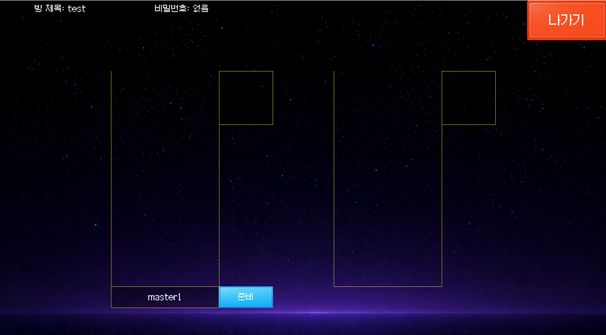
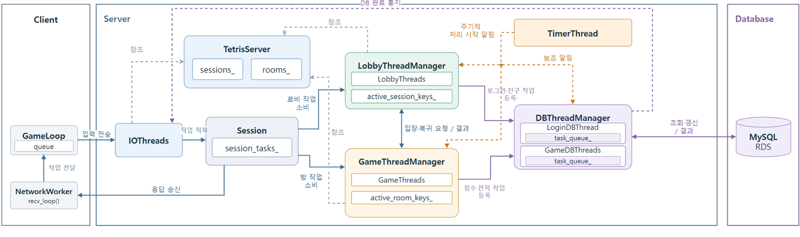

# Tetris — 멀티플레이 게임 서버

기존 테트리스 게임을 모작하며, **C++ 게임 서버와 Python 클라이언트를 직접 구현한 개인 프로젝트**입니다.
최대 5명이 함께 플레이할 수 있으며, 비동기 네트워크 처리와 틱 기반 게임 로직, 세션 동시성 및 수명 관리에 집중했습니다.

- **개발자:** 강은혁
- **개발 범위:** 게임 서버, 게임 클라이언트, 통신 프로토콜, 데이터베이스 연동, 부하 테스트 클라이언트
- **주요 기능:** 싱글 플레이, 2인·5인 멀티플레이, 방 생성·참가 및 빠른 매칭, 전적·랭킹, 로비 채팅·친구 관리

## 클라이언트 화면

| 로비 | 멀티플레이 대기실 |
| --- | --- |
|  |  |

## 기술 스택

| 구분 | 사용 기술 |
| --- | --- |
| Server | C++ · Windows · IOCP(입출력 완료 포트) · Winsock2 · TCP(전송 제어 프로토콜) |
| Client | Python · Pygame |
| Database / Cloud | MySQL · Amazon RDS(관계형 데이터베이스 서비스) |
| Authentication | bcrypt 비밀번호 해시 검증 · Botan |
| Tools | Visual Studio · Git · GitHub |

## 서버 처리 구조

`TetrisServer`가 세션과 방을 보유하고, 각 스레드 매니저가 담당 작업을 분배합니다.
수신한 패킷은 세션 작업 큐에 적재하며, 로비 또는 방의 처리 경로에서 소비합니다.

- **네트워크:** IOThread가 입출력 완료를 처리하고, 수신 버퍼에서 패킷을 분리합니다.
- **로비·게임:** 활성 세션과 방을 작업 스레드에 분배합니다. 세션 작업은 처리 권한을 획득한 소비자가 실행합니다.
- **타이머:** 목표 50Hz(초당 50회), 20ms 간격으로 로비·게임 처리를 시작합니다.
- **데이터베이스:** 로그인과 게임 관련 작업을 별도 스레드·큐에서 처리합니다. 작업 등록 시 즉시 깨우며, 타이머는 보조 알림을 보냅니다.

## 주요 문제와 해결

### 1. 잦은 송신 등록으로 발생한 병목

**문제:** 플레이어별 처리 결과를 각각 방 전체에 전송하면서 `WSASend` 호출이 증가했습니다.

**해결:** 한 틱의 처리 결과를 방 단위로 묶어 참가자에게 전송하도록 변경했습니다. 5명 모두에게 보낼 데이터가 하나의 송신 버퍼에 들어가는 경우, 플레이어별 전체 전송 25회를 방 단위 전송 5회로 줄입니다. 버퍼 크기를 초과하면 나누어 전송합니다.

구현: [TetrisRoom::BroadcastPackets](Server/Rooms/TetrisRoomPackets.cpp)

### 2. 같은 틱의 게임 결과가 클라이언트에 잘못 반영되는 문제

**문제:** 한 틱에서 블록 고정과 공격 줄 추가 등이 함께 발생하면, 패킷 조립 시점의 현재 좌표가 실제 고정 당시 좌표와 달라질 수 있었습니다. 이 경우 클라이언트에서 블록이 잘못된 위치에 표시되었습니다.

**해결:** 입력 도착 순서만으로 결과를 확정하지 않고, 플레이어별 틱 처리 → 공격 분배 → 줄 추가 → 승패 판정 → 다음 블록 생성 순서로 게임 결과를 계산합니다. 이벤트 발생 당시의 좌표 등 필요한 데이터를 작업에 보존하고, 전체 처리가 끝난 뒤 반영 순서에 맞춰 패킷을 조립합니다.

구현: [MultiRoom::ProcessGameTick](Server/Rooms/MultiRoom.cpp) · [패킷 조립 및 고정 좌표 반영](Server/Rooms/TetrisRoomPackets.cpp)

### 3. 여러 처리 경로에서 세션에 접근하면서 복잡해진 상태 관리

**문제:** 세션의 로비·방 전환과 연결 종료가 서로 다른 스레드에서 진행되면서, 각 경로에서 세션 상태를 확인하고 경쟁 상황에 대응해야 했습니다.

**해결:** 세션 관련 요청을 `session_tasks_`에 모으고, 처리 권한을 획득한 소비자가 `ProcessSessionTask`를 통해 실행하도록 경로를 통합했습니다. 활성 목록과 상태 전환 작업을 분리해 로비·방 간 처리를 조정합니다. 동일 세션 작업의 동시 실행을 제한하되, 연결 식별과 소속·상태 검증은 유지합니다.

구현: [Session](Server/Network/Session.cpp) · [LobbyThread::Run](Server/Threads/Lobby/LobbyThread.cpp) · [TetrisServer::ProcessSessionTask](Server/Core/TetrisServer.cpp)

### 4. 비동기 입출력 완료 전에 세션이 재사용되는 문제

**문제:** 연결 종료 직후 세션 슬롯을 재사용하면, 이전 연결의 입출력 완료가 새 연결의 세션에 영향을 줄 수 있습니다.

**해결:** 소켓 종료와 세션 재사용 시점을 분리했습니다. 종료 요청 시 소켓을 닫고, 등록된 입출력의 완료를 `io_pending_count_`로 확인합니다. 이후 방·로비 소속과 잔여 작업을 정리한 뒤 세션을 재사용 가능한 상태로 전환합니다. `SessionKey` 검증도 함께 유지합니다.

구현: [Session::BeginDisconnect / CompleteIO](Server/Network/Session.cpp) · [TetrisServer::FinalizeDisconnect](Server/Core/TetrisServer.cpp)

## 추가 성능 개선

- **송신 버퍼 풀:** 송신 데이터와 오버랩 구조체를 포함하는 버퍼를 재사용해 반복적인 동적 할당을 줄였습니다. 풀이 부족할 때는 동적 할당으로 보완합니다.
- **활성 목록 순회:** 전체 세션·방 저장 공간 대신 활성 세션과 방을 대상으로 작업을 분배합니다.
- **경기 결과 일괄 갱신:** 멀티플레이 참가자의 승패를 하나의 갱신 쿼리로 반영해 데이터베이스 요청 횟수를 줄였습니다.

## 성능 측정

### 송신 개선 전 / 최종 결과

2026-09-06 측정. 서버와 부하 클라이언트를 같은 컴퓨터에서 실행했으며, 모든 대상이 플레이 상태에 진입한 뒤 30초 동안 측정했습니다. 각 클라이언트는 100ms 간격으로 좌우 이동 입력을 교대로 전송합니다.

측정값은 **클라이언트의 입력 송신부터 해당 응답 수신까지의 지연 시간**입니다. 데이터베이스 작업은 로그인·경기 종료 시점 등에 발생하는 저빈도·고비용 작업이므로 기능만 구현하고, 이번 지속 입력 지연 측정에서는 제외했습니다. 실제 경기 전체 및 데이터베이스를 포함한 서비스 수용량과는 구분합니다.

| 플레이 인원 | 개선 전 평균 | 최종 평균 | 개선 전 P99(99백분위) | 최종 P99 |
| ---: | ---: | ---: | ---: | ---: |
| 10,000명 | 27.256ms | 12.298ms | 76ms | 26ms |
| 11,000명 | 33.637ms | 12.657ms | 95ms | 26ms |
| 12,000명 | 42.268ms | 14.205ms | 105ms | 31ms |

12,000명 조건에서 평균 지연은 **약 66.4%**, P99 지연은 **약 70.5%** 감소했습니다. 인원·방식별 각 1회 측정 결과이며, 현재 설정의 최대 접속 수와 당시 시험에 사용한 접속 상한은 구분합니다.

### 과거 틱 처리 측정

틱 처리의 목표는 **50Hz**, 허용 기준은 **30Hz 초과**로 두었습니다. 아래는 최종 송신 비교와 별도로 진행한 2026-08-29 측정입니다.

| 항목 | 결과 |
| --- | ---: |
| 플레이 인원 / 방 수 | 10,000명 / 2,000개 |
| 측정 시간 | 30초 |
| 방별 처리 틱 수 | 모든 방에서 1,500회 |
| 평균 처리 빈도 / 틱 간격 | 50Hz / 20ms |
| 틱 처리 시간 평균 / P99 / 최대 | 2.426ms / 8.403ms / 13.302ms |

## 향후 개선

- **데이터베이스 장애 대응 및 복구:** 실패 원인에 따른 재시도 정책을 분리하고, 미반영 작업의 보존·복구와 중복 갱신 방지를 보완합니다.
- **비정상 패킷 대응:** 기본 길이 검사에 더해 패킷 종류별 크기·필드 값·허용 상태 검증을 강화합니다.

## 코드 구성

| 경로 | 내용 |
| --- | --- |
| [Server/Core](Server/Core) | 서버 초기화, 세션 작업 라우팅, 연결 수명 관리 |
| [Server/Network](Server/Network) | 세션, 비동기 송수신, 버퍼 관리 |
| [Server/Threads](Server/Threads) | 입출력·로비·게임·데이터베이스·타이머 스레드 |
| [Server/Rooms](Server/Rooms) | 방 관리, 게임 틱 처리, 결과 패킷 조립 |
| [Server/Game](Server/Game) | 테트리스 규칙과 플레이어 상태 |
| [client/tetris](client/tetris) | Pygame 클라이언트 |
| [Stress](Stress) | 부하 생성 및 응답 지연 측정 |
